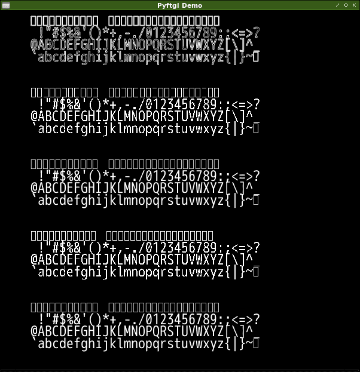

[ja](./README.ja.md)

# Build.python-ftgl

Build a library that uses FTGL in Python.

# DEMO



# Requirement

* <time datetime="2020-04-28T16:14:52+0900">2020-04-28</time>
* [Raspbierry Pi](https://ja.wikipedia.org/wiki/Raspberry_Pi) 4 Model B Rev 1.2
* [Raspbian](https://ja.wikipedia.org/wiki/Raspbian) buster 10.0 2019-09-26 <small>[setup](http://ytyaru.hatenablog.com/entry/2019/12/25/222222)</small>
* bash 5.0.3(1)-release
* Python 2.7.16
* Python 3.7.3
* freetype
* FTGL

```sh
$ uname -a
Linux raspberrypi 4.19.97-v7l+ #1294 SMP Thu Jan 30 13:21:14 GMT 2020 armv7l GNU/Linux
```

# Installation

```sh
sudo apt -y install libftgl-dev
```
```sh
git clone https://github.com/mugwort-rc/python-ftgl
cd python-ftgl
python setup.py build
python3 setup.py build
sudo python setup.py install
sudo python3 setup.py install
```

# Usage

```sh
git clone https://github.com/ytyaru/Build.python-ftgl.20200428161725
cd Build.python-ftgl.20200428161725/src
./run.sh
```

Specify an arbitrary value for the font path.

run.sh
```sh
python example.py /usr/share/fonts/truetype/vlgothic/VL-Gothic-Regular.ttf
python3 example.py /usr/share/fonts/truetype/vlgothic/VL-Gothic-Regular.ttf
```

The font list acquisition command is as follows.

```sh
fc-list
```

# Author

ytyaru

* [](https://github.com/ytyaru "github")
* [](http://ytyaru.hatenablog.com/ytyaru "hatena")
* [](https://mstdn.jp/web/accounts/233143 "mastdon")

# License

This software is CC0 licensed.

[](http://creativecommons.org/publicdomain/zero/1.0/deed.en)

The build source code is below. Thanks.

* https://github.com/mugwort-rc/python-ftgl
* https://github.com/umlaeute/pyftgl

